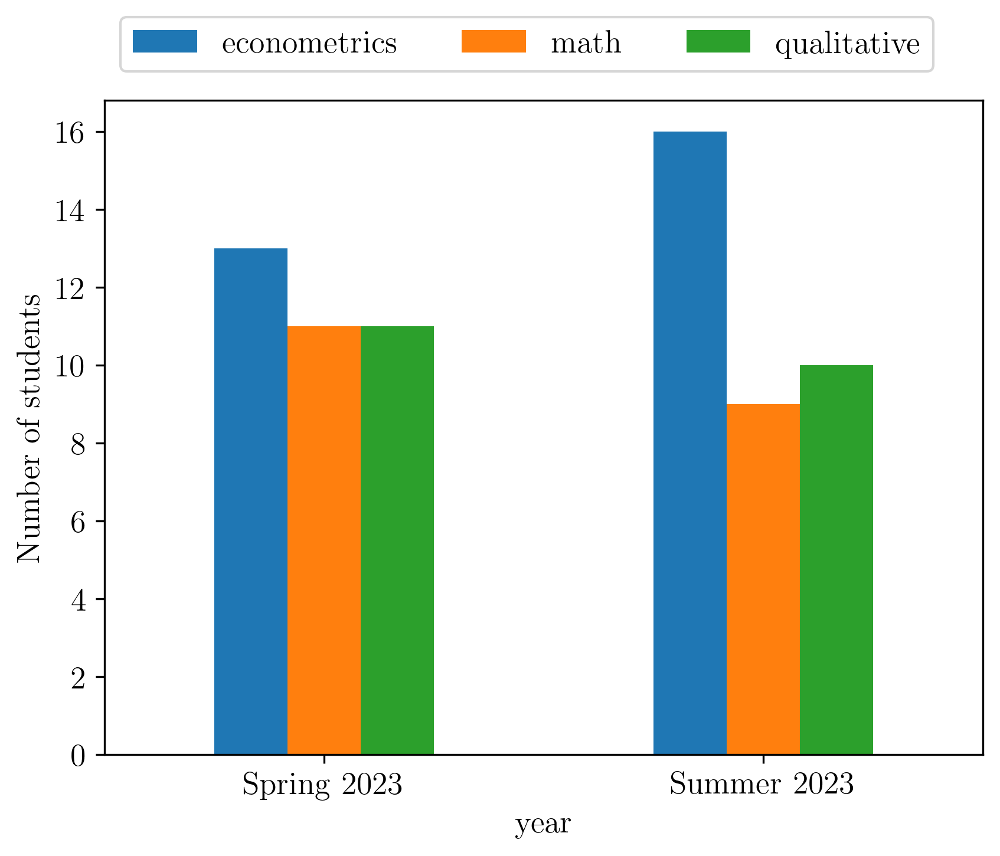

# Tohoku BootCamp for Economists 

[Homepage](https://thanhqtran.github.io/tohoku_bootcamp/) | [Github](https://github.com/thanhqtran/tohoku_bootcamp)

This is the official repository of INSEIKAI Tohoku BootCamp. 

Every year, The Graduate Student Association at Tohoku University (hereby referred to as Inseikai) hosts 2 bootcamps for new graduate students enrolled to either the Master's program or the Ph.D. program. 

To match the enrollment timing, the Spring Camp is organized around February to March, and the Summer Camp is organized around August to September, each lasting from 6 to 9 weeks. 

The Bootcamp is a series of training courses designed to equip new students with mathematic, econometric, and qualitative tools that are necessary for their coursework and research. 

All courses are hosted **on-site** at the [Kawauchi Minami campus](https://goo.gl/maps/CBEscMB3hzLt4Byo7) and are **free of charge**.

## Camps

### [Guide to LaTeX](https://github.com/thanhqtran/tohoku_bootcamp/tree/main/tex_guide)

### [Spring Camp 2023](https://github.com/thanhqtran/tohoku_bootcamp/tree/main/spring2023)

- [Computation](https://github.com/thanhqtran/tohoku_bootcamp/tree/main/spring2023/computation)
- [Mathematics I](https://github.com/thanhqtran/tohoku_bootcamp/tree/main/spring2023/math)
- [Qualitative I](https://github.com/thanhqtran/tohoku_bootcamp/tree/main/spring2023/qualitative)

### [Summer Camp 2023](https://github.com/thanhqtran/tohoku_bootcamp/tree/main/summer2023)

- [Econometrics](https://github.com/thanhqtran/tohoku_bootcamp/tree/main/summer2023/econometrics)
- [Mathematics II](https://github.com/thanhqtran/tohoku_bootcamp/tree/main/summer2023/math)
- [Qualitative II](https://github.com/thanhqtran/tohoku_bootcamp/tree/main/summer2023/qualitative)

## Instructors

Ph.D. students at the Graduate School of Economics and Management, Tohoku University.

The Camp is organized by [Inseikai Tohoku](inseikaitohoku.org) and is grateful for support from the [Research Center for Policy Design](https://www2.econ.tohoku.ac.jp/~PDesign/en.html) and the Graduate School of Economics and Management, Tohoku University.

## Application Link

[https://forms.gle/kLUdVMuyKm6Uf44W8](https://forms.gle/kLUdVMuyKm6Uf44W8)

**Deadline:** August 11, 2023 (Friday) -- 17:00 JST

We recommend you use a Tohoku email account to register.

## Contributors

<!-- readme: collaborators,contributors -start -->
<table>
<tr>
    <td align="center">
        <a href="https://github.com/wulizyk">
            
             
            <b>Yikai ZHAO</b>
        </a>
    </td>
    <td align="center">
        <a href="https://github.com/thanhqtran">
            
             
            <b>Quang-Thanh Tran (tedd)</b>
        </a>
    </td>
    <td align="center">
        <a href="https://github.com/gtxy1979">
            
             
            <b>Tony</b>
        </a>
    </td>
    <td align="center">
        <a href="https://github.com/FengYouxin">
            
             
            <b>Null</b>
        </a>
    </td>
    <td align="center">
        <a href="https://github.com/Dynamicalpotato">
            
             
            <b>Rashed Al Jayousi</b>
        </a>
    </td>
    <td align="center">
        <a href="https://github.com/helensontheway0404">
            
             
            <b>Helensontheway</b>
        </a>
    </td></tr>
</table>
<!-- readme: collaborators,contributors -end -->

Number of students.

